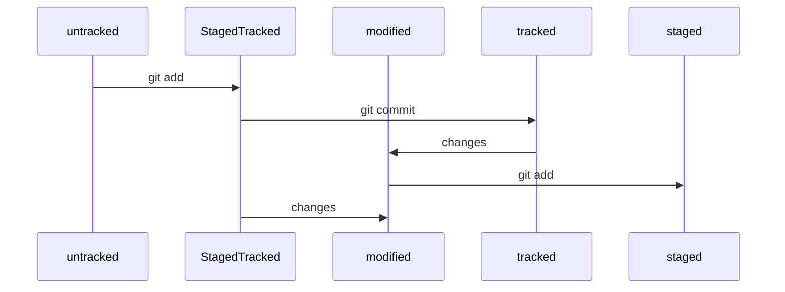

# Шпаргалкос эбаут гит'икоус and море

---

## Линух

1) цд - чендж директори

2) рм - ре мув

3) мкдир - мэйк директори

4) нани - лучший текстовый редактор

5) рмдир - оказывается можно не юзать рм -рф для пустого каталога

6) тауч - руки убрал

7) ехо - слэм

8) элэс - лист дирекетори контентч

9) мв - мув мууув

10) гит - пеин ин зе эсс фор некст фью дейс

---

## Гитос

1. гит - для справки

2. гит конфиг - поменять конфиг

3. гит адд - подготовить файлы к сохранению

4. гит коммит - сохраняет/фиксирует состояние файлов

  * __-m - мессаж__

5. гит лог - история коммитов

6. гит пуш - отправить изменения на удаленный репо 

## хеш

* хеш - идентификатор коммита.Данные там всякие в нем
* гит хеширует инфо с помощью алго SHA-1 и получает для каждого комми свой уник хеш
* 40 символов строка
* любое изменение = нови хеш
* Гит хранит таблитсу соответствий хеш -> инфо о коммите. 
* хеши можно передать аргу ментосом в команды

## Логос

С помощью `git log` можно получить лог (журнал) коммитов.

Элементосы из которых состоит описание:
  * строка из цифор и латинос буквос - хеш коммита
  * Author - аутор
  * Date - дата и время создания комми
  * в конце сообщение комми

Сокращенный лог:

`git log --oneline`

## Head бошка

Файл head - один из служебных файлов каталога .git. Он указывает на коммит, который сделан последним

Внутри файла ссылка на служебный фаел refs/heads/main

head можно указать аргументом для команд, они будут считать, что мы работаем с последним комми

## Статусы файлов

Есть 4 статуса: untracked, tracked, staged, modified

* *untracked* - новые файлы. Гит их видит, но не отслеживает историю их обновлений

* *staged* - файл становится стейджабл после команды гит адд. Файл попадает в staging area, т.е в список файлов, которые попадут в комми

* *tracked* - Файлы, которые были зафиксированы с помощью `git commit`, а так же файлы, которые были добавлены в `staging area` командой `git add`. Т.е все файлы, в которых гит отслеживает изменения

* *modified* - означает, что гит сравнил содержимое файла с последней сохраненной версией и нашел отличия.

_Если добавить файл командой `git add` и затем изменить этот файл, то новое содержимое не будет в стейджинг состоянии. Чтобы добавить в стейджинг последнюю версию, нужно выполнить `git add` еще раз_

Жизненный цикол файла:

